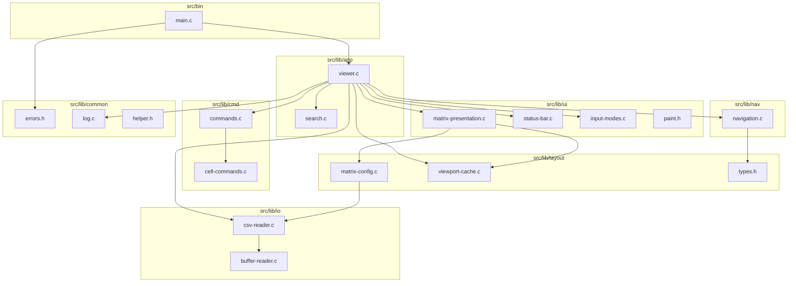

# CSVI Architecture

CSVI is a layered C application: a thin CLI entry point delegates to an application module that orchestrates parsing, layout, navigation, commands, search, and ncurses rendering.

## Module diagram



## Module responsibilities

| Module | Path | Responsibility |
|--------|------|----------------|
| **common** | `src/lib/common/` | Exit codes, stderr logging, shared macros |
| **io** | `src/lib/io/` | Chunked file reads, CSV tokenization, token index |
| **layout** | `src/lib/layout/` | Viewport/cell sizing, precomputed layout cache |
| **ui** | `src/lib/ui/` | ncurses init, single-window grid render, status bar, input modes |
| **nav** | `src/lib/nav/` | Pure cursor/viewport movement |
| **cmd** | `src/lib/cmd/` | Cell-address `:` command parse/dispatch |
| **app** | `src/lib/app/` | `csvi_viewer_t` state, paint strategy, search, executor wiring |
| **bin** | `src/bin/` | Argument parsing only |

## Data flow

1. **Open**: `main` → `csvi_viewer_open` → `csv_reader_read_file` → `buffer_reader_open`
2. **Parse**: `buffer-reader` reads chunks; `csv-reader` builds a linked list of `csv_token` and a dense `index[]` for O(1) lookup
3. **Layout cache**: `viewport_cache_build` precomputes column widths and row heights once per file
4. **Run**: `csvi_viewer_run` → `matrix_presentation_run(viewer_on_key)` with `timeout(50)` event loop
5. **Input**: keys dispatch by input mode (NORMAL/COMMAND/SEARCH/HELP); navigation returns `CURSOR_UPDATED` or `BEEP`
6. **Paint**: viewer compares `top_cell` before/after navigation to choose incremental strategy:

| `paint_action_t` | When |
|------------------|------|
| `PAINT_NONE` | Beep only |
| `PAINT_CURSOR` | Cursor moved, viewport unchanged — redraw two cells |
| `PAINT_VIEWPORT` | Viewport scrolled — redraw visible grid |
| `PAINT_FULL` | Resize, jump, first open, search highlight refresh |

## Ownership and lifecycle

| Resource | Allocated by | Freed by |
|----------|--------------|----------|
| `csvi_viewer_t` | `csvi_viewer_create` | `csvi_viewer_destroy` |
| `csv_contents` / tokens / index | `csv_reader_read_file` | `csv_contents_dispose` |
| `viewport_cache_t` | `viewport_cache_build` | `viewport_cache_dispose` |
| `csvi_search_t` | `csvi_search_create` | `csvi_search_dispose` |
| ncurses session | `matrix_presentation_init` | `matrix_presentation_exit` |

## CLI surface

| Flag | Description |
|------|-------------|
| `-s`, `--separator` | Cell separator (default `;`) |
| `--color=auto\|never\|always` | Color mode (default `auto`; honors `NO_COLOR`) |
| `--grid` | Column separator lines |
| `--header` | Freeze row 0 |
| `-V`, `--verbose` | Log diagnostics to stderr |
| `-h`, `--help` | Usage (stdout) |
| `-v`, `--version` | Version (stdout) |

### Exit codes (`common/errors.h`)

| Code | Meaning |
|------|---------|
| 0 | Success |
| 1 | General error |
| 2 | Usage error |
| 3 | I/O error (file not found, unreadable) |

Key bindings and `:` commands: [Commands.md](../Commands.md)

## Include convention

Build adds `-I$(top_srcdir)/src/lib`. Cross-module includes use layer prefixes:

```c
#include "io/csv-reader.h"
#include "layout/viewport-cache.h"
#include "app/viewer.h"
```

## Known limitations

- Large files load fully into memory via buffer chain; index is `columns × lines` pointers
- `:set sep=` does not re-parse in place — user must reload the file
- UI layer requires ncurses; paint strategy and command parsing are unit-tested; rendering is not
- Horizontal page keys are `Ctrl+H` / `Ctrl+L`

## When to update this document

Update this file when you:

- Add, remove, or rename modules under `src/lib/`
- Change data flow, paint strategy, or ownership between layers
- Add/remove CLI flags or exit codes
- Change build or test layout
