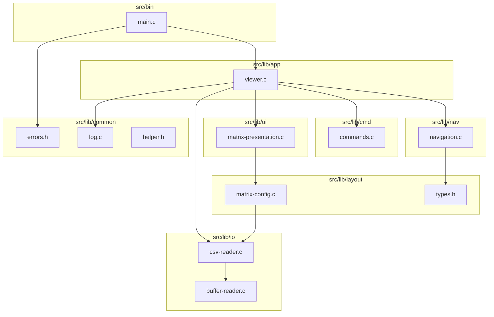

# CSVI Architecture

CSVI is a layered C application: a thin CLI entry point delegates to an application module that orchestrates parsing, layout, navigation, commands, and ncurses rendering.

## Module diagram



## Module responsibilities

| Module | Path | Responsibility |
|--------|------|----------------|
| **common** | `src/lib/common/` | Exit codes, stderr logging, shared macros |
| **io** | `src/lib/io/` | Chunked file reads, CSV tokenization |
| **layout** | `src/lib/layout/` | Viewport/cell sizing; `coordinates_t`, `screen_size_t` |
| **ui** | `src/lib/ui/` | ncurses init, input loop, cell rendering |
| **nav** | `src/lib/nav/` | Pure cursor/viewport movement |
| **cmd** | `src/lib/cmd/` | Regex-based `:` command dispatch |
| **app** | `src/lib/app/` | `csvi_viewer_t` state, paint loop, executor wiring |
| **bin** | `src/bin/` | Argument parsing only |

## Data flow

1. **Open**: `main` → `csvi_viewer_open` → `csv_reader_read_file` → `buffer_reader_open`
2. **Parse**: `buffer-reader` reads chunks; `csv-reader` builds a linked list of `csv_token`
3. **Run**: `csvi_viewer_run` registers handlers and enters `matrix_presentation_handle`
4. **Paint**: `viewer_paint` computes viewport via `matrix_config_get_most_expanded`, renders visible tokens
5. **Input**: keys invoke navigation handlers; Esc opens command mode; `:` commands go through `commands_execute`

## Ownership and lifecycle

| Resource | Allocated by | Freed by |
|----------|--------------|----------|
| `csvi_viewer_t` | `csvi_viewer_create` | `csvi_viewer_destroy` |
| `csv_contents` / tokens | `csv_reader_read_file` | `csv_contents_dispose` (via `csvi_viewer_destroy`) |
| Action handler list | `matrix_presentation_configure_handler` | `matrix_presentation_shutdown` |
| Compiled regexes | `commands_init` | `commands_shutdown` |
| ncurses session | `matrix_presentation_init` | `matrix_presentation_exit` |

## CLI surface

| Flag | Description |
|------|-------------|
| `-s`, `--separator` | Cell separator (default `;`) |
| `-V`, `--verbose` | Log diagnostics to stderr |
| `-h`, `--help` | Usage (stdout) |
| `-v`, `--version` | Version (stdout) |

### Exit codes (`common/errors.h`)

| Code | Meaning |
|------|---------|
| 0 | Success |
| 1 | General error |
| 2 | Usage error |
| 3 | I/O error (file not found, unreadable) |

Key bindings and `:` commands: [Commands.md](../Commands.md)

## Include convention

Build adds `-I$(top_srcdir)/src/lib`. Cross-module includes use layer prefixes:

```c
#include "io/csv-reader.h"
#include "layout/types.h"
#include "app/viewer.h"
```

## Known limitations

- Tokens stored in a singly linked list; `csv_reader_get_token` is **O(n)**
- Large files load fully into memory via buffer chain
- UI layer requires ncurses; not unit-tested directly (logic tested in nav/cmd/layout/io)
- Viewport sizing TODO: screen vs data bounds for page up/down edge cases (see `viewer_paint`)

## When to update this document

Update this file when you:

- Add, remove, or rename modules under `src/lib/`
- Change data flow or ownership between layers
- Add/remove CLI flags or exit codes
- Change build or test layout
